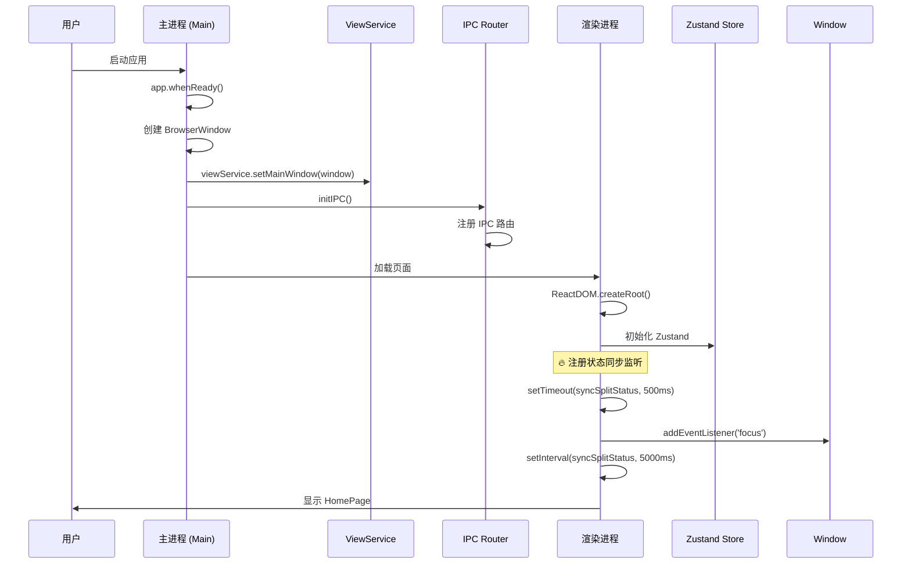
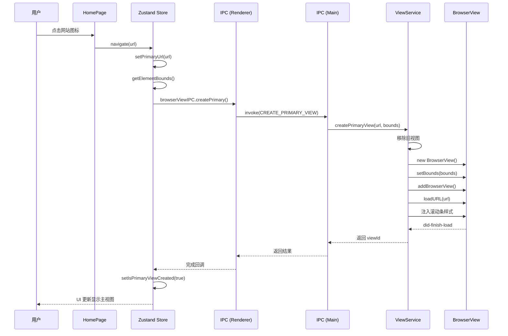
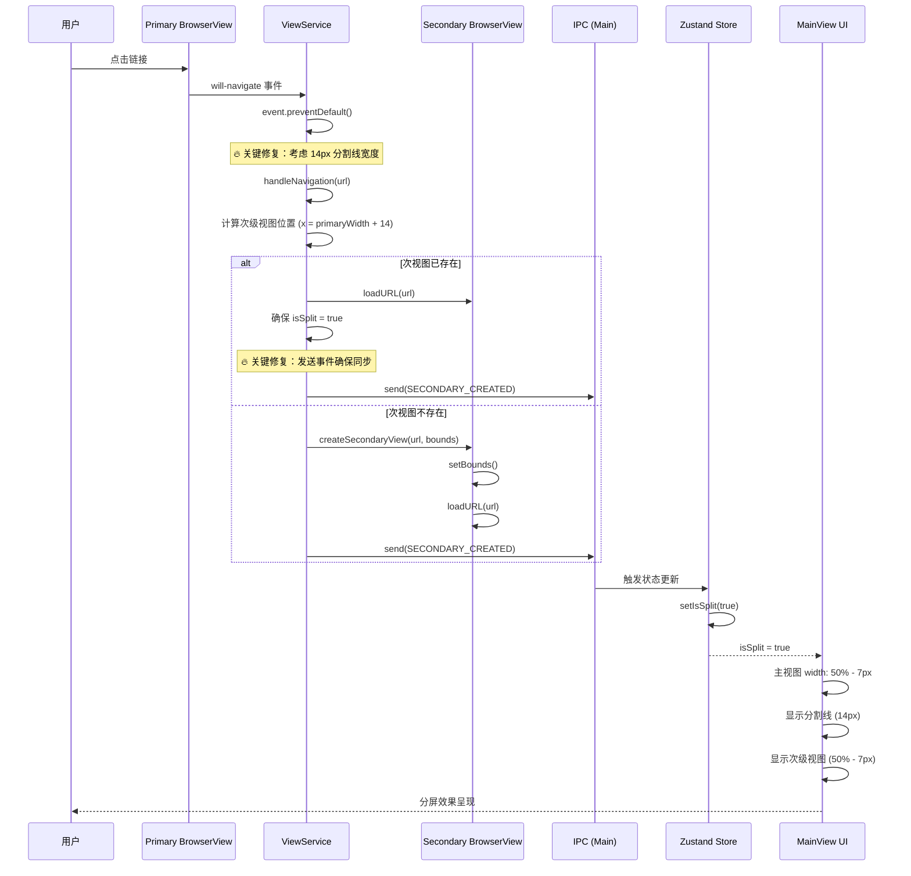
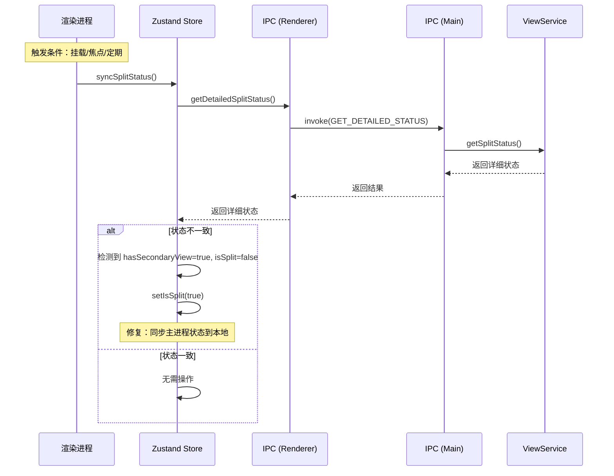
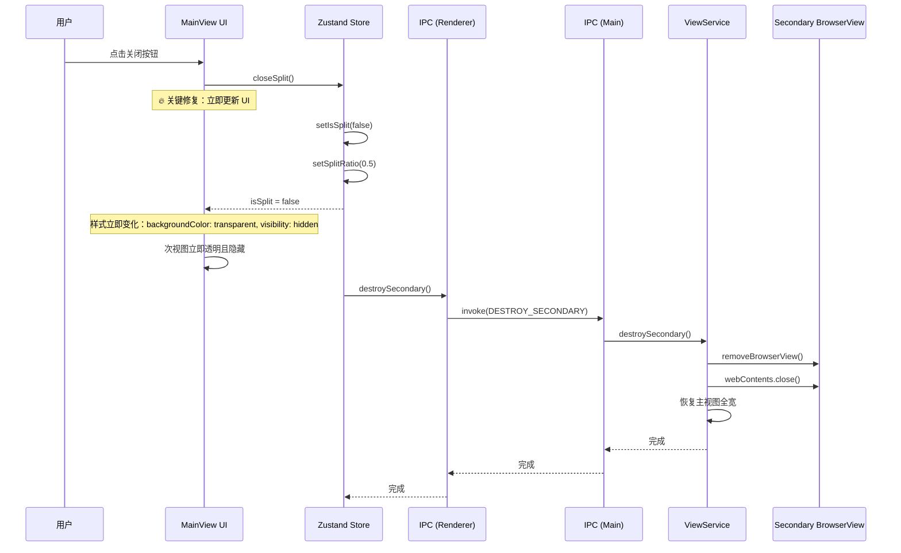

# Web Embedding 分屏功能流程文档

本文档详细说明 Web Embedding 项目的分屏功能实现原理和调用流程，帮助开发人员快速理解系统架构。

**版本**: 3.0  
**作者**: HMETAO  
**最后更新**: 2026-02-01

---

## 📋 目录

1. [架构概述](#架构概述)
2. [核心概念](#核心概念)
3. [分屏调用流程](#分屏调用流程)
   - [初始化流程](#初始化流程)
   - [创建主视图流程](#创建主视图流程)
   - [触发分屏流程](#触发分屏流程)
   - [关闭分屏流程](#关闭分屏流程)
4. [状态同步机制](#状态同步机制)
5. [边界计算修复](#边界计算修复)
6. [时序图](#时序图)
7. [关键代码说明](#关键代码说明)
8. [调试和排错指南](#调试和排错指南)
9. [性能优化建议](#性能优化建议)
10. [IPC 通道完整列表](#ipc-通道完整列表)
11. [常见问题](#常见问题)

---

## 架构概述

Web Embedding 采用 **Electron + React + Zustand** 架构，并使用 **三层分离设计** 实现分屏功能：

```
┌─────────────────────────────────────────────────────────────────────┐
│                    渲染进程 (Renderer Process)                        │
│  ┌──────────────┐  ┌──────────────────┐  ┌──────────────┐          │
│  │   HomePage   │  │  useSplitScreen  │  │   MainView   │          │
│  │   (首页)     │  │   (状态管理)     │  │  (主视图)    │          │
│  └──────────────┘  └──────────────────┘  └──────────────┘          │
│           │                    │                  │               │
│           └────────────────────┼──────────────────┘               │
│                                │                                   │
│                        ┌───────┴───────┐                          │
│                        │  Zustand Store │                          │
│                        │ (全局状态管理)  │                          │
│                        └───────┬───────┘                          │
│                                │                                   │
│                                ▼ IPC 通信                          │
├─────────────────────────────────────────────────────────────────────┤
│                    IPC 通信层 (IPC Layer)                           │
│  ┌──────────────────────────────────────────────────────────────┐  │
│  │  IPC_CHANNELS        IPC_ROUTES        IPC_HANDLERS          │  │
│  │  ├─ create-primary    ├─ main.ts         ├─ viewService.ts    │  │
│  │  ├─ create-secondary  └─ browserView.ts  │   (业务逻辑)        │  │
│  │  ├─ destroy-secondary                    └─ BrowserView API   │  │
│  │  └─ get-detailed-status  ← 新增：状态同步机制                  │  │
│  └──────────────────────────────────────────────────────────────┘  │
├─────────────────────────────────────────────────────────────────────┤
│                    主进程 (Main Process)                            │
│  ┌──────────────────────────────────────────────────────────────┐  │
│  │                     ViewService                              │  │
│  │  ┌──────────────┐        ┌──────────────┐                    │  │
│  │  │ PrimaryView  │        │ SecondaryView│                    │  │
│  │  │   (主视图)   │        │   (次级视图)  │                    │  │
│  │  └──────────────┘        └──────────────┘                    │  │
│  │                                                              │  │
│  │  职责: BrowserView 创建、销毁、边界计算、导航拦截              │  │
│  │  注意: 不包含 IPC 代码，纯业务逻辑                            │  │
│  └──────────────────────────────────────────────────────────────┘  │
└─────────────────────────────────────────────────────────────────────┘
```

### 三层架构设计

项目采用清晰的三层架构，实现关注点分离：

```
┌─────────────────────────────────────────────────────────┐
│  表现层 (Presentation Layer)                            │
│  src/renderer/src/                                      │
│  - React 组件、Zustand 状态管理                          │
│  - 通过 IPC 封装层调用主进程                             │
│  - 状态同步机制（挂载、焦点、定期）                       │
├─────────────────────────────────────────────────────────┤
│  IPC 层 (IPC Layer)                                     │
│  src/ipc/ + src/renderer/src/ipc/                       │
│  - 通道常量: channels.ts                                │
│  - 主进程路由: main.ts                                  │
│  - 渲染进程封装: browserView.ts                         │
│  - 类型定义: types.ts                                   │
├─────────────────────────────────────────────────────────┤
│  业务逻辑层 (Business Layer)                            │
│  src/main/services/viewService.ts                       │
│  - 纯业务逻辑，不直接处理 IPC                            │
│  - BrowserView 创建、销毁、边界计算                      │
│  - 导航拦截和事件监听                                    │
│  - 详细状态查询 (getSplitStatus)                        │
├─────────────────────────────────────────────────────────┤
│  Electron API 层 (Electron API)                         │
│  BrowserView, BrowserWindow, ipcMain, ipcRenderer       │
│  - 底层 Electron API 调用                                │
└─────────────────────────────────────────────────────────┘
```

### 进程职责划分

| 层级           | 职责                         | 关键文件                                   |
| -------------- | ---------------------------- | ------------------------------------------ |
| **表现层**     | UI 渲染、状态管理、用户交互  | React, Zustand, `useSplitScreenStore.ts`   |
| **IPC 层**     | 通信路由、类型安全、通道管理 | `channels.ts`, `main.ts`, `browserView.ts` |
| **业务逻辑层** | BrowserView 管理、导航拦截   | `viewService.ts`                           |
| **API 层**     | Electron 原生功能            | BrowserView, ipcMain                       |

---

## 核心概念

### 1. BrowserView

Electron 提供的 **BrowserView** 用于在窗口中嵌入网页内容，相比 iframe 具有以下优势：

- ✅ 独立渲染进程，性能更好
- ✅ 支持 `webContents` API 精细控制
- ✅ 可拦截 `will-navigate` 事件
- ✅ 无跨域限制

### 2. 双视图架构

系统维护两个 BrowserView 实例：

- **Primary View (主视图)**: 左侧窗口，加载用户初始选择的网站
- **Secondary View (次级视图)**: 右侧窗口，显示从主视图点击的链接

### 3. 状态管理 (Zustand)

使用 **Zustand** 管理分屏状态，集中式管理：

```typescript
interface SplitScreenState {
  isSplit: boolean // 是否处于分屏模式
  primaryUrl: string | null // 主视图当前 URL
  isPrimaryViewCreated: boolean // 主视图是否已创建
  splitRatio: number // 分屏比例 (默认 0.5)
  windowSize: WindowSize // 窗口尺寸
}
```

### 4. 状态同步机制（关键）

由于主进程和渲染进程的状态可能不一致，我们实现了**三层同步机制**：

1. **事件驱动同步**: `SECONDARY_CREATED` 事件通知渲染进程
2. **主动查询同步**: `GET_DETAILED_STATUS` IPC 通道主动查询
3. **定期同步**: 每 5 秒自动检查一次状态

**同步时机**：

- 组件挂载后（500ms 延迟）
- 窗口获得焦点时
- 每 5 秒定期检查

### 5. 边界计算（含分割线宽度）

**关键设计**: DOM 中分割线宽度为 **14px**，BrowserView 边界计算必须考虑这个宽度。

```typescript
// DOM 布局
主视图: calc(50% - 7px) + 分割线(14px) + 次视图: calc(50% - 7px)

// BrowserView 边界计算
主视图宽度: totalWidth * ratio
次视图 x: primaryWidth + 14
次视图宽度: totalWidth - primaryWidth - 14
```

---

## 分屏调用流程

### 初始化流程

应用启动时，主进程和渲染进程的初始化顺序：

```
1. 主进程启动 (main/index.ts)
   └─ 创建 BrowserWindow
   └─ 初始化 ViewService (业务逻辑层)
   └─ 注册 IPC 路由 (ipc/main.ts)

2. 渲染进程启动 (renderer/main.tsx)
   └─ 加载 React 应用
   └─ 初始化 Zustand Store
   └─ 显示 HomePage 首页
   └─ 注册状态同步监听 (挂载后、焦点、定期)
```

**关键代码** (`src/main/index.ts`):

```typescript
app.whenReady().then(() => {
  // 1. 创建主窗口
  const mainWindow = createWindow()

  // 2. 初始化业务逻辑层 (ViewService)
  viewService.setMainWindow(mainWindow)

  // 3. 初始化 IPC 路由
  initIPC()
})
```

---

### 创建主视图流程

用户从首页选择网站后，创建主 BrowserView 的完整流程：

```
用户点击网站
    │
    ▼
HomePage.onNavigate(url)
    │
    ▼
useSplitScreenStore.navigate(url)
    │
    ├─ setPrimaryUrl(url) [更新 Zustand 状态]
    │
    ▼ (延迟 100ms 确保 DOM 渲染)
计算容器位置 (getElementBounds)
    │
    ▼ IPC 调用 (渲染层 → IPC 层)
browserViewIPC.createPrimary(url, bounds)
    │
    ▼ IPC 路由 (ipc/main.ts)
ipcMain.handle(IPC_CHANNELS.CREATE_PRIMARY_VIEW, ...)
    │
    ▼ 业务逻辑层 (viewService.ts)
ViewService.createPrimaryView(url, bounds)
    │
    ├─ 创建新的 BrowserView 实例
    ├─ 设置位置和大小 (setBounds)
    ├─ 添加到主窗口 (addBrowserView)
    ├─ 加载 URL (loadURL)
    └─ 监听 will-navigate 事件
    │
    ▼
主视图显示网站内容
```

**关键代码** (`src/renderer/src/hooks/useSplitScreenStore.ts`):

```typescript
const navigate = useCallback((url: string) => {
  setPrimaryUrl(url)

  setTimeout(() => {
    if (!primaryContainerRef.current) return
    const bounds = getElementBounds(primaryContainerRef.current)
    if (!bounds) return

    browserViewIPC.createPrimaryView(url, bounds)
    setIsPrimaryViewCreated(true)
  }, 100)
}, [])
```

**关键代码** (`src/main/services/viewService.ts`):

```typescript
createPrimaryView(url: string, bounds: ViewBounds): void {
  // 1. 清理旧视图
  if (this.primaryView) {
    this.cleanupView(this.primaryView)
    this.primaryView = null
  }

  // 2. 创建新视图
  this.primaryView = new BrowserView({
    webPreferences: {
      nodeIntegration: false,
      contextIsolation: true
    }
  })

  // 3. 设置位置和加载 URL
  this.primaryView.setBounds(bounds)
  this.mainWindow.addBrowserView(this.primaryView)
  this.primaryView.webContents.loadURL(url)

  // 4. 监听导航事件（触发分屏的关键）
  this.primaryView.webContents.on('will-navigate', (event, url) => {
    event.preventDefault()
    this.handleNavigation(url)
  })

  // 5. 保存 URL
  this.primaryUrl = url

  console.log('[ViewService] 主视图已创建:', url)
}
```

---

### 触发分屏流程

用户在主视图中点击链接时，自动触发分屏的核心机制：

```
用户在主视图点击链接
    │
    ▼ 触发事件
PrimaryView.webContents.on('will-navigate', ...)
    │
    ▼ 阻止默认导航
event.preventDefault()
    │
    ▼ 业务逻辑层
ViewService.handleNavigation(url) ← 🔥 关键：边界计算
    │
    ├─ 获取主视图当前边界
    ├─ 计算次级视图位置 (右侧，考虑 14px 分割线宽度)
    │
    ▼
ViewService.createSecondaryView(url, bounds)
    │
    ├─ 如果已存在：更新 URL + 发送 SECONDARY_CREATED 事件
    ├─ 如果不存在：创建次级 BrowserView
    │
    ▼ IPC 通知
mainWindow.webContents.send(SECONDARY_CREATED, url)
    │
    ▼ 渲染进程 (Zustand Store 监听)
useSplitScreenStore.onSecondaryCreated()
    │
    ▼
setIsSplit(true) [更新状态]
    │
    ▼ UI 更新
主视图宽度变为 50% - 7px，右侧显示分割线 + 次级视图
```

**关键代码** (`src/main/services/viewService.ts`):

```typescript
/**
 * 🔥 关键修复：处理导航事件
 * 边界计算必须考虑 DOM 中 14px 的分割线宽度
 */
private handleNavigation(url: string): void {
  if (!this.mainWindow || !this.primaryView) {
    console.warn('[ViewService] 无法处理导航')
    return
  }

  // 获取主视图的当前位置
  const primaryBounds = this.primaryView.getBounds()
  const windowBounds = this.mainWindow.getBounds()
  const dividerWidth = 14 // DOM 中分割线的宽度

  // 🔥 关键修复：边界计算必须考虑分割线宽度
  // 次视图的 x 坐标 = 主视图右边界 + 分割线宽度
  // 次视图的宽度 = 窗口宽度 - 主视图宽度 - 分割线宽度
  this.createSecondaryView(url, {
    x: primaryBounds.x + primaryBounds.width + dividerWidth,
    y: primaryBounds.y,
    width: Math.max(0, windowBounds.width - primaryBounds.width - dividerWidth),
    height: primaryBounds.height
  })

  console.log('[ViewService] 导航已拦截，在次级窗口打开:', url)
}
```

**🔥 关键修复代码** (`createSecondaryView` 中已存在视图时的处理):

```typescript
// 如果已存在，更新 URL 并确保状态同步
if (this.secondaryView) {
  this.secondaryView.webContents.loadURL(url)
  this.updateSecondaryBounds(bounds)

  // 🔥 关键修复：确保 isSplit 状态正确
  if (!this.isSplit) {
    this.isSplit = true
  }

  // 🔥 关键修复：发送事件确保渲染进程同步
  this.mainWindow.webContents.send(IPCChannels.BrowserView.SECONDARY_CREATED, {
    url,
    timestamp: Date.now()
  })
  return
}
```

---

### 关闭分屏流程

用户点击"关闭分屏"按钮后的清理流程：

```
用户点击关闭按钮
    │
    ▼
useSplitScreenStore.closeSplit()
    │
    ├─ IPC 调用销毁次级视图
    ├─ setIsSplit(false) [立即更新状态]
    ├─ setSplitRatio(0.5) [重置比例]
    │
    ▼ IPC 层 (browserView.ts)
browserViewIPC.destroySecondary()
    │
    ▼ IPC 路由 (main.ts)
ipcMain.handle(IPC_CHANNELS.DESTROY_SECONDARY, ...)
    │
    ▼ 业务逻辑层 (viewService.ts)
ViewService.destroySecondary()
    │
    ├─ 从窗口移除 BrowserView
    ├─ 关闭 webContents
    ├─ 清理引用
    └─ 恢复主视图全宽
    │
    ▼
UI 更新：主视图恢复 100%，次视图透明度变为 0，背景透明
```

**关键代码** (`src/main/services/viewService.ts`):

```typescript
destroySecondary(): void {
  if (this.secondaryView) {
    // 1. 从窗口移除
    this.mainWindow.removeBrowserView(this.secondaryView)

    // 2. 关闭 webContents
    this.secondaryView.webContents.close()

    // 3. 清理引用
    this.secondaryView = null
    this.isSplit = false

    // 4. 恢复主视图全宽
    if (this.primaryView) {
      const windowBounds = this.mainWindow.getBounds()
      const height = windowBounds.height - 40 // 减去导航栏
      this.primaryView.setBounds({
        x: 0,
        y: 40,
        width: windowBounds.width,
        height
      })
    }

    console.log('[ViewService] 次级视图已销毁')
  }
}
```

**🔥 关键修复代码** (MainView.tsx 中的样式修复):

```tsx
{/* 次级视图占位区域 */}
<div
  ref={secondaryContainerRef}
  style={{
    width: isSplit ? `calc(${(1 - splitRatio) * 100}% - 7px)` : '0%',
    opacity: isSplit ? 1 : 0,
    // 🔥 关键修复：关闭分屏时立即隐藏背景，消除白屏闪烁
    backgroundColor: isSplit ? '#f3f4f6' : 'transparent',
    visibility: isSplit ? 'visible' : 'hidden',
    transition: isDragging ? 'none' : 'width 0.3s ease-in-out'
  }}
>
```

---

## 状态同步机制

### 为什么需要状态同步？

**问题场景**：

1. 用户已分屏（主进程 `isSplit = true`，渲染进程 `isSplit = true`）
2. 用户点击主视图链接（触发 `handleNavigation`）
3. `createSecondaryView` 检测到次视图已存在，只更新 URL
4. **问题**：由于某些原因，渲染进程的 `isSplit` 被意外重置为 `false`
5. **结果**：DOM 中分割线不显示，但 BrowserView 次级视图仍然存在

**解决方案**：实现**状态同步机制**，确保主进程和渲染进程状态一致。

### 三层同步机制

```
┌─────────────────────────────────────────────────────────┐
│                    三层同步机制                           │
├─────────────────────────────────────────────────────────┤
│  1. 事件驱动同步 (Event-Driven)                          │
│     - 触发时机: createSecondaryView 被调用时              │
│     - 实现方式: 发送 SECONDARY_CREATED 事件               │
│     - 作用: 通知渲染进程更新 isSplit 状态                 │
├─────────────────────────────────────────────────────────┤
│  2. 主动查询同步 (Active Query)                          │
│     - 触发时机: 组件挂载、窗口焦点、定期                  │
│     - 实现方式: GET_DETAILED_STATUS IPC 调用              │
│     - 作用: 主动查询主进程状态，检测并修复不一致          │
├─────────────────────────────────────────────────────────┤
│  3. 定期同步 (Periodic Sync)                             │
│     - 触发时机: 每 5 秒自动执行                           │
│     - 实现方式: setInterval                               │
│     - 作用: 兜底保障，确保长期运行后状态仍然一致          │
└─────────────────────────────────────────────────────────┘
```

### 详细实现

**1. IPC 通道定义** (`src/ipc/channels.ts`):

```typescript
export const IPCChannels = {
  BrowserView: {
    // ... 现有通道
    GET_DETAILED_STATUS: 'browser-view:get-detailed-status' // 🔥 新增
  }
}
```

**2. 类型定义** (`src/ipc/types.ts`):

```typescript
// 请求类型
export interface IPCRequestMap {
  [IPCChannels.BrowserView.GET_DETAILED_STATUS]: never // 无参数
}

// 响应类型
export interface IPCResponseMap {
  [IPCChannels.BrowserView.GET_DETAILED_STATUS]: {
    isSplit: boolean
    hasSecondaryView: boolean
    primaryUrl: string
    secondaryUrl: string
  }
}
```

**3. 主进程实现** (`src/main/services/viewService.ts`):

```typescript
/**
 * 获取当前分屏状态（详细）
 * 用于渲染进程查询和状态同步
 */
getSplitStatus(): {
  isSplit: boolean
  hasSecondaryView: boolean
  primaryUrl: string
  secondaryUrl: string
} {
  return {
    isSplit: this.isSplit,
    hasSecondaryView: this.secondaryView !== null,
    primaryUrl: this.primaryUrl,
    secondaryUrl: this.secondaryUrl
  }
}
```

**4. IPC 路由** (`src/ipc/main.ts`):

```typescript
// 获取详细状态
this.register(IPCChannels.BrowserView.GET_DETAILED_STATUS, async () => {
  return viewService.getSplitStatus()
})
```

**5. 渲染进程封装** (`src/renderer/src/ipc/browserView.ts`):

```typescript
/**
 * 获取详细分屏状态
 */
async getDetailedSplitStatus(): Promise<{
  isSplit: boolean
  hasSecondaryView: boolean
  primaryUrl: string
  secondaryUrl: string
}> {
  const result = await ipc.invoke(IPCChannels.BrowserView.GET_DETAILED_STATUS)
  return result.success ? result.data! : {
    isSplit: false,
    hasSecondaryView: false,
    primaryUrl: '',
    secondaryUrl: ''
  }
}
```

**6. Hook 中的状态同步** (`src/renderer/src/hooks/useSplitScreenStore.ts`):

```typescript
/**
 * 同步分屏状态
 * 主动查询主进程状态并同步本地状态
 */
const syncSplitStatus = useCallback(async () => {
  if (!isPrimaryViewCreated) return

  try {
    const detailedStatus = await browserViewIPC.getDetailedSplitStatus()

    // 🔥 关键修复：如果主进程有次视图但本地状态没有，则同步
    if (detailedStatus.hasSecondaryView && !isSplit) {
      console.log('[useSplitScreen] 检测到状态不一致，同步分屏状态')
      setIsSplit(true)
    }

    // 🔥 关键修复：如果主进程没有次视图但本地状态有，则重置
    if (!detailedStatus.hasSecondaryView && isSplit) {
      console.log('[useSplitScreen] 检测到状态不一致，重置分屏状态')
      setIsSplit(false)
      setSplitRatio(0.5)
    }
  } catch (error) {
    console.warn('[useSplitScreen] 状态同步失败:', error)
  }
}, [isPrimaryViewCreated, isSplit, setIsSplit, setSplitRatio])

// 🔥 关键修复：组件挂载后同步状态
useEffect(() => {
  const timer = setTimeout(() => {
    syncSplitStatus()
  }, 500)
  return () => clearTimeout(timer)
}, [syncSplitStatus])

// 🔥 关键修复：窗口获得焦点时同步状态
useEffect(() => {
  const handleFocus = (): void => {
    syncSplitStatus()
  }
  window.addEventListener('focus', handleFocus)
  return () => window.removeEventListener('focus', handleFocus)
}, [syncSplitStatus])

// 🔥 关键修复：定期状态检查
useEffect(() => {
  if (!isPrimaryViewCreated) return

  const interval = setInterval(() => {
    syncSplitStatus()
  }, 5000)

  return () => clearInterval(interval)
}, [isPrimaryViewCreated, syncSplitStatus])
```

---

## 边界计算修复

### 问题描述

**现象**：分屏状态下再次点击左侧主视图的链接，分割线会消失。

**根本原因**：`handleNavigation` 方法在计算次视图边界时，**没有考虑 DOM 中 14px 的分割线宽度**。

### DOM 布局 vs BrowserView 边界

**DOM 布局** (Flexbox):

```
总宽度: 100%
┌─────────────────────────────────────────────────────────────┐
│ 主视图: calc(50% - 7px) │ 分割线: 14px │ 次视图: calc(50% - 7px) │
│        (50% - 7px)     │    (14px)    │       (50% - 7px)      │
└─────────────────────────────────────────────────────────────┘
```

**原代码** (错误):

```typescript
// 错误：没有考虑分割线宽度
const secondaryBounds = {
  x: primaryBounds.x + primaryBounds.width, // 错误：紧贴主视图右侧
  width: windowBounds.width - primaryBounds.width // 错误：占满剩余空间
}
```

**修复后** (正确):

```typescript
// 正确：考虑 14px 分割线宽度
const dividerWidth = 14

const secondaryBounds = {
  x: primaryBounds.x + primaryBounds.width + dividerWidth, // 正确：跳过分割线
  width: Math.max(0, windowBounds.width - primaryBounds.width - dividerWidth) // 正确：减去分割线宽度
}
```

### 修复代码

```typescript
/**
 * 🔥 关键修复：处理导航事件
 * 边界计算必须考虑 DOM 中 14px 的分割线宽度
 */
private handleNavigation(url: string): void {
  if (!this.mainWindow || !this.primaryView) {
    console.warn('[ViewService] 无法处理导航：主窗口或主视图不存在')
    return
  }

  // 获取主视图的当前位置
  const primaryBounds = this.primaryView.getBounds()
  const windowBounds = this.mainWindow.getBounds()
  const dividerWidth = 14 // DOM 中分割线的宽度

  // 🔥 关键修复：边界计算必须考虑分割线宽度
  // 次视图的 x 坐标 = 主视图右边界 + 分割线宽度
  // 次视图的宽度 = 窗口宽度 - 主视图宽度 - 分割线宽度
  this.createSecondaryView(url, {
    x: primaryBounds.x + primaryBounds.width + dividerWidth,
    y: primaryBounds.y,
    width: Math.max(0, windowBounds.width - primaryBounds.width - dividerWidth),
    height: primaryBounds.height
  })

  console.log('[ViewService] 导航已拦截，在次级窗口打开:', url)
}
```

### updateSplitRatio 中的边界计算

`updateSplitRatio` 方法已经正确处理了分割线宽度：

```typescript
updateSplitRatio(ratio: number): void {
  // ...
  const availableWidth = totalWidth - 14 // 减去分割线宽度

  // 更新主视图
  const primaryWidth = Math.round(availableWidth * ratio)

  // 更新次级视图
  const secondaryBounds = {
    x: primaryWidth + 14, // SplitDivider 右侧
    width: availableWidth - primaryWidth
  }
}
```

---

## 时序图

### 1. 应用启动时序（含状态同步）



### 2. 创建主视图时序



### 3. 触发分屏时序（含修复）



### 4. 状态同步时序



### 5. 关闭分屏时序（含白屏修复）



---

## 关键代码说明

### 1. 三层架构实现

**核心原则**: 业务逻辑、IPC 通信、Electron API 三层分离。

```typescript
// ❌ 不好的代码（三层混合）
function createBrowserView(url: string) {
  const view = new BrowserView() // 直接调用 API
  view.webContents.loadURL(url)

  ipcMain.handle('navigate', () => {
    // 直接处理 IPC
    view.webContents.loadURL(url)
  })

  view.setBounds({ x: 0, y: 0, width: 800, height: 600 }) // 硬编码
}

// ✅ 好的代码（三层分离）

// 1. 业务逻辑层 - viewService.ts
export class ViewService {
  private views = new Map<string, BrowserView>()

  createView(id: string, url: string): BrowserView {
    const view = new BrowserView({ webPreferences: { sandbox: true } })
    view.webContents.loadURL(url)
    this.views.set(id, view)
    return view
  }
}

// 2. IPC 层 - channels.ts
export const IPCChannels = {
  CREATE_BROWSER_VIEW: 'create-browser-view'
} as const

// 3. IPC 路由 - main.ts
export function setupIpcHandlers(viewService: ViewService) {
  ipcMain.handle(IPCChannels.CREATE_BROWSER_VIEW, (event, id: string, url: string) => {
    return viewService.createView(id, url)
  })
}

// 4. 渲染进程封装 - browserView.ts
export const browserViewIPC = {
  create: (id: string, url: string) => ipcRenderer.invoke(IPCChannels.CREATE_BROWSER_VIEW, id, url)
}
```

### 2. IPC 通道管理

**核心机制**: 所有 IPC 通道必须使用常量，禁止硬编码。

```typescript
// src/ipc/channels.ts
/**
 * IPC 通道名称常量
 * 所有 IPC 通信必须使用这些常量，禁止硬编码字符串
 */
export const IPCChannels = {
  /** 创建主视图 */
  CREATE_PRIMARY_VIEW: 'browser-view:create-primary',
  /** 创建次级视图 */
  CREATE_SECONDARY_VIEW: 'browser-view:create-secondary',
  /** 销毁次级视图 */
  DESTROY_SECONDARY_VIEW: 'browser-view:destroy-secondary',
  /** 更新视图边界 */
  UPDATE_VIEW_BOUNDS: 'browser-view:update-bounds',
  /** 获取分屏状态 */
  GET_STATUS: 'browser-view:get-status',
  /** 🔥 新增：获取详细分屏状态 */
  GET_DETAILED_STATUS: 'browser-view:get-detailed-status',
  /** 🔥 新增：更新分屏比例 */
  UPDATE_SPLIT_RATIO: 'browser-view:update-split-ratio',
  /** 🔥 新增：显示遮罩层（拖动时使用） */
  SHOW_OVERLAY: 'browser-view:show-overlay',
  /** 🔥 新增：隐藏遮罩层 */
  HIDE_OVERLAY: 'browser-view:hide-overlay',
  /** 次级视图创建完成事件 */
  SECONDARY_VIEW_CREATED: 'browser-view:secondary-created',
  /** 导航被拦截事件 */
  NAVIGATION_BLOCKED: 'browser-view:navigation-blocked'
} as const
```

### 3. 状态同步 Hook 实现

```typescript
// src/renderer/src/hooks/useSplitScreenStore.ts

/**
 * 🔥 关键修复：同步分屏状态
 * 主动查询主进程状态并同步本地状态
 */
const syncSplitStatus = useCallback(async () => {
  if (!isPrimaryViewCreated) return

  try {
    const detailedStatus = await browserViewIPC.getDetailedSplitStatus()

    // 🔥 关键修复：如果主进程有次视图但本地状态没有，则同步
    if (detailedStatus.hasSecondaryView && !isSplit) {
      console.log('[useSplitScreen] 检测到状态不一致，同步分屏状态')
      setIsSplit(true)
    }

    // 🔥 关键修复：如果主进程没有次视图但本地状态有，则重置
    if (!detailedStatus.hasSecondaryView && isSplit) {
      console.log('[useSplitScreen] 检测到状态不一致，重置分屏状态')
      setIsSplit(false)
      setSplitRatio(0.5)
    }
  } catch (error) {
    console.warn('[useSplitScreen] 状态同步失败:', error)
  }
}, [isPrimaryViewCreated, isSplit, setIsSplit, setSplitRatio])

// 🔥 关键修复：组件挂载后同步状态
useEffect(() => {
  const timer = setTimeout(() => {
    syncSplitStatus()
  }, 500)
  return () => clearTimeout(timer)
}, [syncSplitStatus])

// 🔥 关键修复：窗口获得焦点时同步状态
useEffect(() => {
  const handleFocus = (): void => {
    syncSplitStatus()
  }
  window.addEventListener('focus', handleFocus)
  return () => window.removeEventListener('focus', handleFocus)
}, [syncSplitStatus])

// 🔥 关键修复：定期状态检查
useEffect(() => {
  if (!isPrimaryViewCreated) return

  const interval = setInterval(() => {
    syncSplitStatus()
  }, 5000)

  return () => clearInterval(interval)
}, [isPrimaryViewCreated, syncSplitStatus])
```

### 4. 防白屏样式修复

```typescript
// src/renderer/src/pages/MainView.tsx

{/* 次级视图占位区域 */}
<div
  ref={secondaryContainerRef}
  className="h-full relative"
  style={{
    // 减去 7px 为分割线留出空间
    width: isSplit ? `calc(${(1 - splitRatio) * 100}% - 7px)` : '0%',
    flexShrink: 0,
    opacity: isSplit ? 1 : 0,
    overflow: 'hidden',
    // 🔥 关键修复：关闭分屏时立即隐藏背景，消除白屏闪烁
    backgroundColor: isSplit ? '#f3f4f6' : 'transparent',
    visibility: isSplit ? 'visible' : 'hidden',
    // 关键：拖动时禁用 transition，避免闪烁
    transition: isDragging ? 'none' : 'width 0.3s ease-in-out'
  }}
>
```

---

## 调试和排错指南

### 查看 IPC 通信日志

在控制台启用详细日志：

```typescript
// 在 main.ts 或渲染进程中添加
console.log('[IPC] 发送:', channel, payload)
console.log('[IPC] 接收:', channel, result)
```

### 调试 BrowserView 边界

在 ViewService 中添加边界日志：

```typescript
private logViewBounds(viewName: string, bounds: ViewBounds): void {
  console.log(`[ViewService] ${viewName} 边界:`, {
    x: bounds.x,
    y: bounds.y,
    width: bounds.width,
    height: bounds.height
  })
}
```

### 状态不一致排查

检查控制台日志中的状态同步信息：

```
[useSplitScreen] 检测到状态不一致，同步分屏状态
[useSplitScreen] 主进程状态: {isSplit: true, hasSecondaryView: true}
[useSplitScreen] 本地状态: {isSplit: false}
[useSplitScreen] 执行修复: setIsSplit(true)
```

### 常见问题排查

**Q1: 分割线不显示**

检查步骤：

1. 查看 `isSplit` 状态是否为 `true`
2. 检查控制台是否有状态同步日志
3. 验证 `SECONDARY_CREATED` 事件是否正确发送
4. 使用 `getDetailedSplitStatus` 检查主进程状态

**Q2: 关闭分屏时有白屏**

检查步骤：

1. 确认 `MainView.tsx` 中的样式修复已应用
2. 检查 `backgroundColor` 和 `visibility` 是否正确设置
3. 验证 `closeSplit` 函数是否先更新状态再销毁视图

**Q3: 分屏比例调整不生效**

检查步骤：

1. 验证 `updateSplitRatio` IPC 调用是否成功
2. 检查 `updateSplitRatio` 方法是否减去 14px 分割线宽度
3. 查看 BrowserView 边界是否正确更新
4. 确认 DOM 宽度计算与 BrowserView 边界一致

---

## 性能优化建议

### 1. BrowserView 创建和销毁

**优化建议**：

- 避免频繁创建/销毁 BrowserView，重用已创建的实例
- 使用 `webContents.reload()` 代替销毁后重新创建
- 延迟加载非活动视图的内容

### 2. 状态同步频率控制

**当前实现**：

- 挂载后：500ms 延迟，单次执行
- 窗口焦点：即时执行
- 定期同步：每 5 秒执行

**优化建议**：

- 如果应用长期运行，可考虑动态调整同步频率
- 在分屏模式下增加同步频率，非分屏模式下降低频率

### 3. CSS Transition 最佳实践

**当前实现**：

```css
transition: isDragging ? 'none' : 'width 0.3s ease-in-out'
```

**优化建议**：

- 拖动时禁用 transition 是正确的，避免性能问题
- 考虑使用 `transform` 代替 `width` 以获得更好的性能（GPU 加速）
- 但需要注意 BrowserView 边界必须与 DOM 同步

### 4. 内存管理建议

**当前实现**：

- 组件卸载时调用 `destroyAllViews()`
- 关闭分屏时清理次级视图

**优化建议**：

- 添加内存使用监控
- 定期清理未使用的 BrowserView 实例
- 使用 `webContents.close()` 彻底释放资源

---

## IPC 通道完整列表

| 通道名                | 类型   | 参数               | 返回值        | 使用场景         | 位置           |
| --------------------- | ------ | ------------------ | ------------- | ---------------- | -------------- |
| **BrowserView**       |        |                    |               |                  |                |
| `CREATE_PRIMARY`      | send   | `{url, bounds}`    | -             | 创建主视图       | channels.ts:10 |
| `UPDATE_BOUNDS`       | send   | `{type, bounds}`   | -             | 更新视图边界     | channels.ts:11 |
| `DESTROY_SECONDARY`   | send   | -                  | -             | 销毁次级视图     | channels.ts:12 |
| `DESTROY_ALL`         | send   | -                  | -             | 销毁所有视图     | channels.ts:13 |
| `GET_STATUS`          | invoke | -                  | `boolean`     | 获取分屏状态     | channels.ts:14 |
| `GET_DETAILED_STATUS` | invoke | -                  | `SplitStatus` | 🔥 获取详细状态  | channels.ts:15 |
| `UPDATE_SPLIT_RATIO`  | send   | `{ratio}`          | -             | 🔥 更新分屏比例  | channels.ts:18 |
| `SHOW_OVERLAY`        | send   | -                  | -             | 🔥 显示遮罩层    | channels.ts:21 |
| `HIDE_OVERLAY`        | send   | -                  | -             | 🔥 隐藏遮罩层    | channels.ts:22 |
| `SECONDARY_CREATED`   | on     | `{url, timestamp}` | -             | 次级视图创建事件 | channels.ts:27 |
| `NAVIGATION_BLOCKED`  | on     | `{fromUrl, toUrl}` | -             | 导航拦截事件     | channels.ts:28 |
| **Window**            |        |                    |               |                  |                |
| `RESIZE`              | on     | `{width, height}`  | -             | 窗口大小变化     | channels.ts:33 |
| `FOCUS`               | on     | -                  | -             | 窗口获得焦点     | channels.ts:34 |
| **System**            |        |                    |               |                  |                |
| `GET_VERSION`         | invoke | -                  | `string`      | 获取应用版本     | channels.ts:39 |
| `OPEN_EXTERNAL`       | send   | `{url}`            | -             | 打开外部链接     | channels.ts:40 |

**类型定义** (`src/ipc/types.ts`):

```typescript
// SplitStatus 类型
interface SplitStatus {
  isSplit: boolean
  hasSecondaryView: boolean
  primaryUrl: string
  secondaryUrl: string
}

// ViewBounds 类型
interface ViewBounds {
  x: number
  y: number
  width: number
  height: number
}
```

---

## 常见问题

### Q1: 为什么点击链接会触发分屏而不是在当前窗口打开？

**原因**: 主进程监听了 `will-navigate` 事件并调用了 `event.preventDefault()`，阻止了默认导航行为，改为创建次级 BrowserView 显示新页面。

**关键代码位置**: `src/main/services/viewService.ts:handleNavigation()`

### Q2: 分屏后如何同步两个视图的滚动位置？

**现状**: 当前实现未同步滚动位置，两个视图独立滚动。

**改进建议**: 可通过 `webContents.executeJavaScript()` 在页面间同步滚动事件。

**实现思路**:

```typescript
// 在主视图滚动时同步到次级视图
primaryView.webContents.on('scroll', () => {
  const scrollY = primaryView.webContents.executeJavaScript('window.scrollY')
  secondaryView.webContents.executeJavaScript(`window.scrollTo(0, ${scrollY})`)
})
```

### Q3: 为什么使用 BrowserView 而不是 iframe？

**对比**:

| 特性     | BrowserView      | iframe       |
| -------- | ---------------- | ------------ |
| 性能     | 独立进程，更好   | 与页面同进程 |
| 跨域     | 无限制           | 受限制       |
| 导航拦截 | ✅ will-navigate | ❌ 困难      |
| CSP 限制 | 无               | 有           |
| 样式注入 | ✅ insertCSS     | ❌ 困难      |

### Q4: 如何添加新的 IPC 功能？

**标准流程** (必须遵循):

1. **添加通道常量** (`src/ipc/channels.ts`):

   ```typescript
   export const IPCChannels = {
     // ... 现有通道
     NEW_FEATURE: 'new-feature' // 新增
   } as const
   ```

2. **添加类型定义** (`src/ipc/types.ts`):

   ```typescript
   export interface NewFeaturePayload {
     data: string
   }
   ```

3. **实现主进程处理** (`src/ipc/main.ts`):

   ```typescript
   this.register(IPCChannels.NEW_FEATURE, async (payload) => {
     return viewService.newFeature(payload)
   })
   ```

4. **添加渲染进程封装** (`src/renderer/src/ipc/browserView.ts`):

   ```typescript
   export const browserViewIPC = {
     // ... 现有方法
     newFeature: (data: string) => ipcRenderer.invoke(IPC_CHANNELS.NEW_FEATURE, { data })
   }
   ```

5. **在 Zustand 中使用** (`src/renderer/src/hooks/useSplitScreenStore.ts`):
   ```typescript
   newFeature: async (data: string) => {
     await browserViewIPC.newFeature(data)
     set({
       /* 更新状态 */
     })
   }
   ```

---

## 附录：文件结构

```
src/
├── ipc/                           # IPC 通信层（类型安全）⭐
│   ├── channels.ts                # IPC 通道名称常量
│   ├── types.ts                   # IPC 类型定义
│   └── main.ts                    # 主进程 IPC 路由器
├── main/                          # Electron 主进程
│   ├── index.ts                   # 主进程入口
│   └── services/                  # 业务服务层（三层架构）⭐
│       └── viewService.ts         # BrowserView 纯业务逻辑
├── preload/                       # Electron 预加载脚本
│   ├── index.ts                   # 预加载入口
│   └── index.d.ts                 # 类型声明
└── renderer/src/                  # React 渲染器进程
    ├── components/                # React 组件
    │   └── SplitDivider.tsx       # 可拖动分割线组件 ⭐
    ├── hooks/                     # 自定义 Hooks
    │   └── useSplitScreenStore.ts # Zustand + 状态同步 ⭐
    ├── ipc/                       # 渲染进程 IPC 封装
    │   └── browserView.ts         # BrowserView IPC 类型安全封装
    ├── pages/                     # 页面组件
    │   ├── Home.tsx               # 首页
    │   └── MainView.tsx           # 分屏主界面
    ├── stores/                    # 配置文件
    │   └── config.ts              # 预设网站配置
    ├── App.tsx                    # 根组件
    ├── main.tsx                   # 渲染器入口
    └── RouteConfig.tsx            # 路由配置
```

**核心文件**:

- `src/ipc/channels.ts`: IPC 通道常量定义
- `src/ipc/types.ts`: IPC 类型定义（含 SplitStatus）
- `src/ipc/main.ts`: IPC 路由配置（含 GET_DETAILED_STATUS）
- `src/main/services/viewService.ts`: BrowserView 业务逻辑 ⭐（含状态同步和边界计算修复）
- `src/renderer/src/ipc/browserView.ts`: 渲染进程 IPC 封装（含 getDetailedSplitStatus）
- `src/renderer/src/hooks/useSplitScreenStore.ts`: Zustand 状态管理 ⭐（含三层同步机制）
- `src/renderer/src/pages/MainView.tsx`: 分屏 UI 渲染（含白屏修复）
- `src/renderer/src/components/SplitDivider.tsx`: 可拖动分割线组件

---

## 已解决问题记录

### ✅ 问题 1: 重复点击主视图时分割线消失

**现象**: 分屏状态下再次点击左侧窗口创建的新窗口无中间杆子

**根本原因**:

1. `createSecondaryView` 检测到次视图已存在时，只更新 URL，不发送 `SECONDARY_CREATED` 事件
2. 渲染进程的 `isSplit` 状态与主进程不同步

**修复方案**:

1. 在 `createSecondaryView` 中，即使次视图已存在也发送 `SECONDARY_CREATED` 事件
2. 实现三层状态同步机制（事件驱动 + 主动查询 + 定期同步）

**关键代码**: `viewService.ts:104-119`, `useSplitScreenStore.ts:296-360`

---

### ✅ 问题 2: 关闭分屏时出现白屏闪烁

**现象**: 点击关闭分屏按钮，右侧出现一段时间白色区域

**根本原因**:

1. 次级 BrowserView 立即被销毁
2. 但 UI 容器仍在执行 300ms 的 CSS 动画
3. 背景色 `#f3f4f6` 在动画期间可见

**修复方案**:

1. 修改次级视图容器样式：`backgroundColor: isSplit ? '#f3f4f6' : 'transparent'`
2. 添加 `visibility: isSplit ? 'visible' : 'hidden'`

**关键代码**: `MainView.tsx:140-149`

---

### ✅ 问题 3: 边界计算未考虑分割线宽度

**现象**: 分屏后再次点击左侧链接，分割线位置不正确或消失

**根本原因**: `handleNavigation` 方法计算次视图边界时，没有考虑 DOM 中 14px 的分割线宽度

**修复方案**:

1. 次视图 x 坐标：`primaryWidth + 14`
2. 次视图宽度：`totalWidth - primaryWidth - 14`

**关键代码**: `viewService.ts:450-466`

---

_文档版本: 3.0_  
_最后更新: 2026-02-01_  
_作者: HMETAO_  
_架构版本: 三层分离架构 + 状态同步机制 (Business → IPC → Electron API)_
