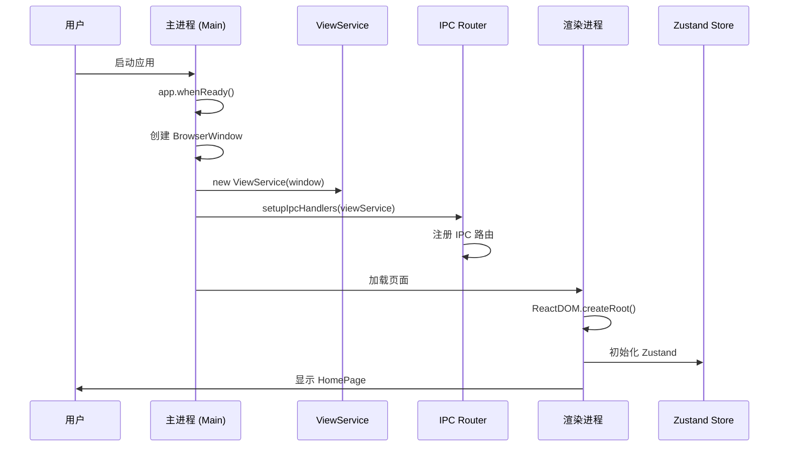
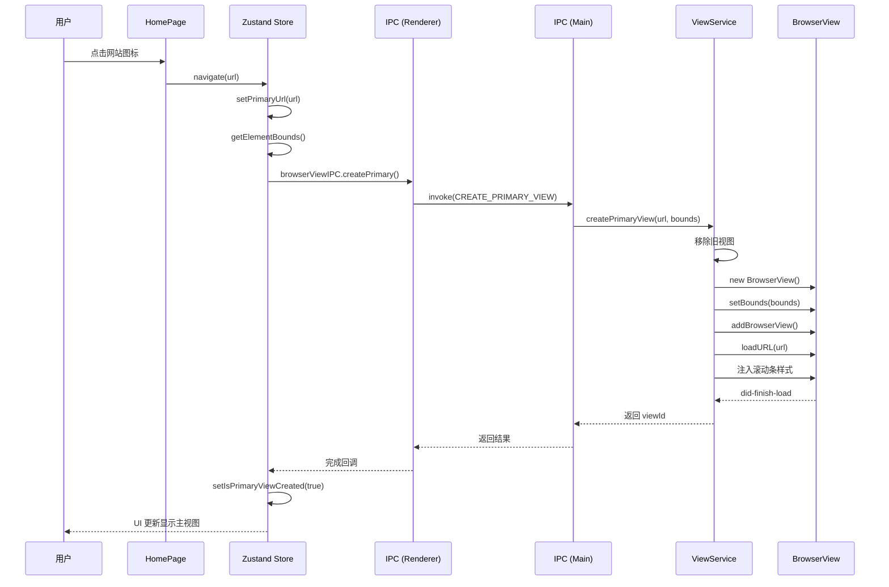
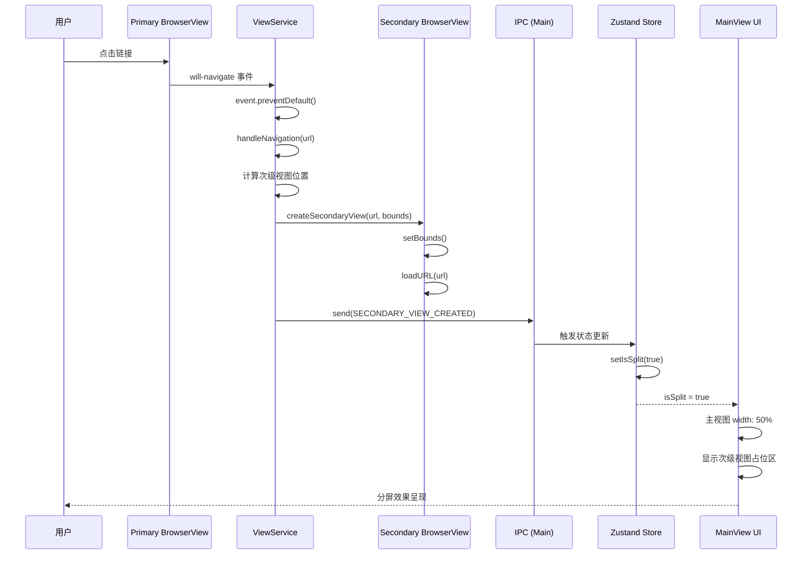
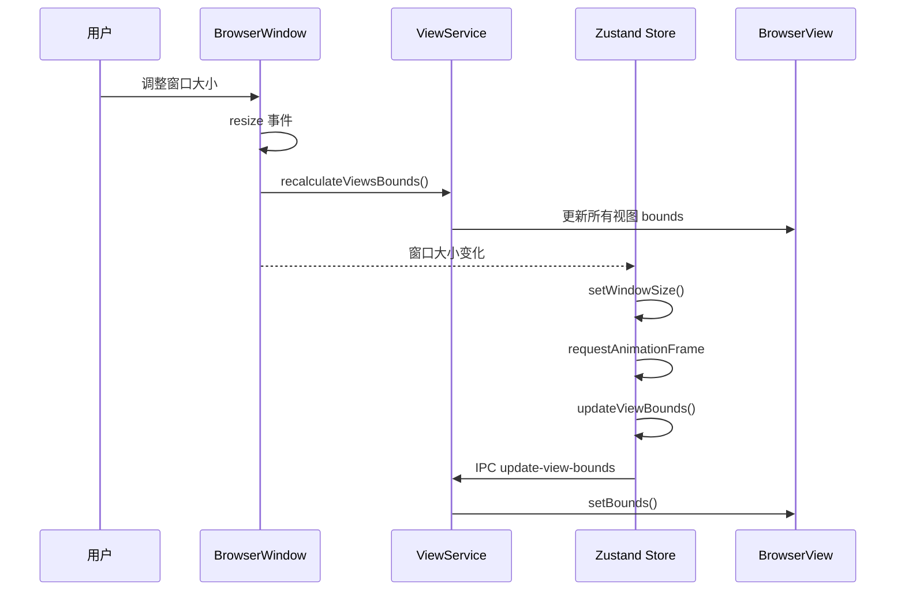

# Web Embedding 分屏功能流程文档

本文档详细说明 Web Embedding 项目的分屏功能实现原理和调用流程，帮助开发人员快速理解系统架构。

## 📋 目录

1. [架构概述](#架构概述)
2. [核心概念](#核心概念)
3. [分屏调用流程](#分屏调用流程)
   - [初始化流程](#初始化流程)
   - [创建主视图流程](#创建主视图流程)
   - [触发分屏流程](#触发分屏流程)
   - [关闭分屏流程](#关闭分屏流程)
4. [时序图](#时序图)
5. [关键代码说明](#关键代码说明)
6. [常见问题](#常见问题)

---

## 架构概述

Web Embedding 采用 **Electron + React + Zustand** 架构，并使用 **三层分离设计** 实现分屏功能：

```
┌─────────────────────────────────────────────────────────────────────┐
│                    渲染进程 (Renderer Process)                        │
│  ┌──────────────┐  ┌──────────────────┐  ┌──────────────┐          │
│  │   HomePage   │  │  useSplitScreen  │  │   MainView   │          │
│  │   (首页)     │  │   (状态管理)     │  │  (主视图)    │          │
│  └──────────────┘  └──────────────────┘  └──────────────┘          │
│           │                    │                  │               │
│           └────────────────────┼──────────────────┘               │
│                                │                                   │
│                        ┌───────┴───────┐                          │
│                        │  Zustand Store │                          │
│                        │ (全局状态管理)  │                          │
│                        └───────┬───────┘                          │
│                                │                                   │
│                                ▼ IPC 通信                          │
├─────────────────────────────────────────────────────────────────────┤
│                    IPC 通信层 (IPC Layer)                           │
│  ┌──────────────────────────────────────────────────────────────┐  │
│  │  IPC_CHANNELS        IPC_ROUTES        IPC_HANDLERS          │  │
│  │  ├─ create-primary    ├─ main.ts         ├─ viewService.ts    │  │
│  │  ├─ create-secondary  └─ browserView.ts  │   (业务逻辑)        │  │
│  │  └─ destroy-secondary                    └─ BrowserView API   │  │
│  └──────────────────────────────────────────────────────────────┘  │
├─────────────────────────────────────────────────────────────────────┤
│                    主进程 (Main Process)                            │
│  ┌──────────────────────────────────────────────────────────────┐  │
│  │                     ViewService                              │  │
│  │  ┌──────────────┐        ┌──────────────┐                    │  │
│  │  │ PrimaryView  │        │ SecondaryView│                    │  │
│  │  │   (主视图)   │        │   (次级视图)  │                    │  │
│  │  └──────────────┘        └──────────────┘                    │  │
│  │                                                              │  │
│  │  职责: BrowserView 创建、销毁、边界计算、导航拦截              │  │
│  │  注意: 不包含 IPC 代码，纯业务逻辑                            │  │
│  └──────────────────────────────────────────────────────────────┘  │
└─────────────────────────────────────────────────────────────────────┘
```

### 三层架构设计

项目采用清晰的三层架构，实现关注点分离：

```
┌─────────────────────────────────────────────────────────┐
│  表现层 (Presentation Layer)                            │
│  src/renderer/src/                                      │
│  - React 组件、Zustand 状态管理                          │
│  - 通过 IPC 封装层调用主进程                             │
├─────────────────────────────────────────────────────────┤
│  IPC 层 (IPC Layer)                                     │
│  src/ipc/ + src/renderer/src/ipc/                       │
│  - 通道常量: channels.ts                                │
│  - 主进程路由: main.ts                                  │
│  - 渲染进程封装: browserView.ts                         │
├─────────────────────────────────────────────────────────┤
│  业务逻辑层 (Business Layer)                            │
│  src/main/services/viewService.ts                       │
│  - 纯业务逻辑，不直接处理 IPC                            │
│  - BrowserView 创建、销毁、边界计算                      │
│  - 导航拦截和事件监听                                    │
├─────────────────────────────────────────────────────────┤
│  Electron API 层 (Electron API)                         │
│  BrowserView, BrowserWindow, ipcMain, ipcRenderer       │
│  - 底层 Electron API 调用                                │
└─────────────────────────────────────────────────────────┘
```

### 进程职责划分

| 层级           | 职责                         | 关键文件                                   |
| -------------- | ---------------------------- | ------------------------------------------ |
| **表现层**     | UI 渲染、状态管理、用户交互  | React, Zustand, `useSplitScreenStore.ts`   |
| **IPC 层**     | 通信路由、类型安全、通道管理 | `channels.ts`, `main.ts`, `browserView.ts` |
| **业务逻辑层** | BrowserView 管理、导航拦截   | `viewService.ts`                           |
| **API 层**     | Electron 原生功能            | BrowserView, ipcMain                       |

---

## 核心概念

### 1. BrowserView

Electron 提供的 **BrowserView** 用于在窗口中嵌入网页内容，相比 iframe 具有以下优势：

- ✅ 独立渲染进程，性能更好
- ✅ 支持 `webContents` API 精细控制
- ✅ 可拦截 `will-navigate` 事件
- ✅ 无跨域限制

### 2. 双视图架构

系统维护两个 BrowserView 实例：

- **Primary View (主视图)**: 左侧窗口，加载用户初始选择的网站
- **Secondary View (次级视图)**: 右侧窗口，显示从主视图点击的链接

### 3. 状态管理 (Zustand)

使用 **Zustand** 管理分屏状态，集中式管理：

```typescript
interface SplitScreenState {
  isSplit: boolean // 是否处于分屏模式
  primaryUrl: string | null // 主视图当前 URL
  isPrimaryViewCreated: boolean // 主视图是否已创建
  splitRatio: number // 分屏比例 (默认 0.5)
  windowSize: WindowSize // 窗口尺寸
}
```

### 4. IPC 架构

**核心原则**: 所有 IPC 通信必须通过 `channels.ts` 中定义的常量，禁止硬编码字符串。

```typescript
// src/ipc/channels.ts
export const IPC_CHANNELS = {
  CREATE_PRIMARY_VIEW: 'create-primary-view',
  CREATE_SECONDARY_VIEW: 'create-secondary-view',
  DESTROY_SECONDARY_VIEW: 'destroy-secondary-view',
  UPDATE_VIEW_BOUNDS: 'update-view-bounds'
  // ... 其他通道
} as const
```

---

## 分屏调用流程

### 初始化流程

应用启动时，主进程和渲染进程的初始化顺序：

```
1. 主进程启动 (main/index.ts)
   └─ 创建 BrowserWindow
   └─ 初始化 ViewService (业务逻辑层)
   └─ 注册 IPC 路由 (ipc/main.ts)

2. 渲染进程启动 (renderer/main.tsx)
   └─ 加载 React 应用
   └─ 初始化 Zustand Store
   └─ 显示 HomePage 首页
```

**关键代码** (`src/main/index.ts`):

```typescript
app.whenReady().then(() => {
  // 1. 创建主窗口
  const mainWindow = createWindow()

  // 2. 初始化业务逻辑层 (ViewService)
  const viewService = new ViewService(mainWindow)

  // 3. 初始化 IPC 路由，将业务层注入 IPC 层
  setupIpcHandlers(viewService)
})
```

---

### 创建主视图流程

用户从首页选择网站后，创建主 BrowserView 的完整流程：

```
用户点击网站
    │
    ▼
HomePage.onNavigate(url)
    │
    ▼
useSplitScreenStore.navigate(url)
    │
    ├─ setPrimaryUrl(url) [更新 Zustand 状态]
    │
    ▼ (延迟 100ms 确保 DOM 渲染)
计算容器位置 (getElementBounds)
    │
    ▼ IPC 调用 (渲染层 → IPC 层)
browserViewIPC.createPrimary(url, bounds)
    │
    ▼ IPC 路由 (ipc/main.ts)
ipcMain.handle(IPC_CHANNELS.CREATE_PRIMARY_VIEW, ...)
    │
    ▼ 业务逻辑层 (viewService.ts)
ViewService.createPrimaryView(url, bounds)
    │
    ├─ 创建新的 BrowserView 实例
    ├─ 设置位置和大小 (setBounds)
    ├─ 添加到主窗口 (addBrowserView)
    ├─ 加载 URL (loadURL)
    └─ 监听 will-navigate 事件
    │
    ▼
主视图显示网站内容
```

**关键代码** (`src/renderer/src/hooks/useSplitScreenStore.ts`):

```typescript
navigate: async (url: string) => {
  // 1. 更新状态
  set({ primaryUrl: url })

  // 2. 延迟创建 BrowserView
  setTimeout(() => {
    const bounds = getElementBounds(primaryContainerRef.current)
    // 3. 通过 IPC 层调用
    browserViewIPC.createPrimary(url, bounds)
    set({ isPrimaryViewCreated: true })
  }, 100)
}
```

**关键代码** (`src/main/services/viewService.ts`):

```typescript
/**
 * 创建主视图 BrowserView
 * @param url - 要加载的网站 URL
 * @param bounds - 视图边界 {x, y, width, height}
 * @returns 创建的 BrowserView 实例 ID
 */
createPrimaryView(url: string, bounds: ViewBounds): string {
  // 1. 清理旧视图
  if (this.primaryView) {
    this.destroyPrimaryView()
  }

  // 2. 创建新视图
  const view = new BrowserView({
    webPreferences: { sandbox: true }
  })

  // 3. 设置位置和加载 URL
  view.setBounds(bounds)
  this.mainWindow.addBrowserView(view)
  view.webContents.loadURL(url)

  // 4. 监听导航事件（触发分屏的关键）
  view.webContents.on('will-navigate', (event, url) => {
    event.preventDefault()
    this.handleNavigation(url)
  })

  // 5. 存储引用
  this.primaryView = view
  return 'primary'
}
```

---

### 触发分屏流程

用户在主视图中点击链接时，自动触发分屏的核心机制：

```
用户在主视图点击链接
    │
    ▼ 触发事件
PrimaryView.webContents.on('will-navigate', ...)
    │
    ▼ 阻止默认导航
event.preventDefault()
    │
    ▼ 业务逻辑层
ViewService.handleNavigation(url)
    │
    ├─ 计算主视图当前边界
    ├─ 计算次级视图位置 (右侧 50%)
    │
    ▼
ViewService.createSecondaryView(url, bounds)
    │
    ├─ 创建次级 BrowserView
    ├─ 设置位置 (主视图右侧)
    └─ 加载新 URL
    │
    ▼ IPC 通知 (通过主窗口通知渲染进程)
mainWindow.webContents.send(IPC_CHANNELS.SECONDARY_VIEW_CREATED, url)
    │
    ▼ 渲染进程 (Zustand Store 监听)
useSplitScreenStore.onSecondaryViewCreated()
    │
    ▼
set({ isSplit: true }) [更新状态]
    │
    ▼ UI 更新
主视图宽度变为 50%，右侧显示次级视图
```

**关键代码** (`src/main/services/viewService.ts`):

```typescript
/**
 * 处理导航事件 - 核心分屏逻辑
 * 当用户在主视图点击链接时触发
 * @param url - 目标 URL
 */
private handleNavigation(url: string): void {
  // 1. 获取主视图当前边界
  const primaryBounds = this.primaryView!.getBounds()
  const windowBounds = this.mainWindow.getBounds()

  // 2. 计算次级视图边界（右侧 50%）
  const secondaryBounds = {
    x: primaryBounds.x + primaryBounds.width,
    y: primaryBounds.y,
    width: windowBounds.width - primaryBounds.width,
    height: primaryBounds.height
  }

  // 3. 创建次级视图
  this.createSecondaryView(url, secondaryBounds)

  // 4. 调整主视图宽度为 50%
  this.updateViewBounds('primary', primaryBounds, 0.5)

  // 5. 通知渲染进程更新状态
  this.mainWindow.webContents.send(
    IPC_CHANNELS.SECONDARY_VIEW_CREATED,
    url
  )
}
```

---

### 关闭分屏流程

用户点击"关闭分屏"按钮后的清理流程：

```
用户点击关闭按钮
    │
    ▼
useSplitScreenStore.closeSplit()
    │
    ├─ IPC 调用销毁次级视图
    │
    ▼ IPC 层 (browserView.ts)
browserViewIPC.destroySecondary()
    │
    ▼ IPC 路由 (main.ts)
ipcMain.handle(IPC_CHANNELS.DESTROY_SECONDARY_VIEW, ...)
    │
    ▼ 业务逻辑层 (viewService.ts)
ViewService.destroySecondaryView()
    │
    ├─ 从窗口移除 BrowserView
    ├─ 关闭 webContents
    └─ 清理引用
    │
    ▼
set({ isSplit: false }) [更新状态]
    │
    ▼ UI 更新
主视图恢复 100% 宽度
    │
    ▼
ViewService.updateViewBounds() [更新 BrowserView 位置]
```

**关键代码** (`src/main/services/viewService.ts`):

```typescript
/**
 * 销毁次级视图
 * 清理资源并恢复主视图全宽
 */
destroySecondaryView(): void {
  if (this.secondaryView) {
    // 1. 从窗口移除
    this.mainWindow.removeBrowserView(this.secondaryView)

    // 2. 关闭 webContents
    this.secondaryView.webContents.close()

    // 3. 清理引用
    this.secondaryView = null

    // 4. 恢复主视图全宽
    if (this.primaryView) {
      const windowBounds = this.mainWindow.getBounds()
      const contentBounds = this.mainWindow.getContentBounds()
      this.updateViewBounds('primary', contentBounds, 1.0)
    }
  }
}
```

---

## 时序图

### 1. 应用启动时序



### 2. 创建主视图时序



### 3. 触发分屏时序



### 4. 窗口大小调整时序



---

## 关键代码说明

### 1. 三层架构实现

**核心原则**: 业务逻辑、IPC 通信、Electron API 三层分离。

```typescript
// ❌ 不好的代码（三层混合）
function createBrowserView(url: string) {
  const view = new BrowserView() // 直接调用 API
  view.webContents.loadURL(url)

  ipcMain.handle('navigate', () => {
    // 直接处理 IPC
    view.webContents.loadURL(url)
  })

  view.setBounds({ x: 0, y: 0, width: 800, height: 600 }) // 硬编码
}

// ✅ 好的代码（三层分离）

// 1. 业务逻辑层 - viewService.ts
export class ViewService {
  private views = new Map<string, BrowserView>()

  createView(id: string, url: string): BrowserView {
    const view = new BrowserView({ webPreferences: { sandbox: true } })
    view.webContents.loadURL(url)
    this.views.set(id, view)
    return view
  }
}

// 2. IPC 层 - channels.ts
export const IPC_CHANNELS = {
  CREATE_BROWSER_VIEW: 'create-browser-view'
} as const

// 3. IPC 路由 - main.ts
export function setupIpcHandlers(viewService: ViewService) {
  ipcMain.handle(IPC_CHANNELS.CREATE_BROWSER_VIEW, (event, id: string, url: string) => {
    return viewService.createView(id, url)
  })
}

// 4. 渲染进程封装 - browserView.ts
export const browserViewIPC = {
  create: (id: string, url: string) => ipcRenderer.invoke(IPC_CHANNELS.CREATE_BROWSER_VIEW, id, url)
}
```

### 2. IPC 通道管理

**核心机制**: 所有 IPC 通道必须使用常量，禁止硬编码。

```typescript
// src/ipc/channels.ts
/**
 * IPC 通道名称常量
 * 所有 IPC 通信必须使用这些常量，禁止硬编码字符串
 */
export const IPC_CHANNELS = {
  /** 创建主视图 */
  CREATE_PRIMARY_VIEW: 'create-primary-view',
  /** 创建次级视图 */
  CREATE_SECONDARY_VIEW: 'create-secondary-view',
  /** 销毁次级视图 */
  DESTROY_SECONDARY_VIEW: 'destroy-secondary-view',
  /** 更新视图边界 */
  UPDATE_VIEW_BOUNDS: 'update-view-bounds',
  /** 次级视图创建完成事件 */
  SECONDARY_VIEW_CREATED: 'secondary-view-created'
} as const

// 使用时
ipcMain.handle(IPC_CHANNELS.CREATE_PRIMARY_VIEW, handler)
// 而不是
ipcMain.handle('create-primary-view', handler) // ❌ 禁止
```

### 3. BrowserView 边界计算

**核心机制**: BrowserView 是覆盖在渲染进程之上的原生控件，需要精确的像素坐标。

```typescript
/**
 * 计算指定类型 BrowserView 的边界矩形
 * @param type - 视图类型：'primary' | 'secondary'
 * @param containerBounds - 容器窗口边界
 * @param splitRatio - 分屏比例（0-1），默认 0.5
 * @returns 计算后的边界矩形对象
 */
function calculateViewBounds(
  type: ViewType,
  containerBounds: Rectangle,
  splitRatio = 0.5
): Rectangle {
  if (type === 'primary') {
    return {
      ...containerBounds,
      width: containerBounds.width * splitRatio
    }
  }

  // secondary
  return {
    ...containerBounds,
    x: containerBounds.width * splitRatio,
    width: containerBounds.width * (1 - splitRatio)
  }
}

// 使用
const bounds = calculateViewBounds('primary', windowBounds, 0.5)
view.setBounds(bounds)
```

### 4. 链接拦截机制

**核心机制**: 监听 `will-navigate` 事件拦截所有链接点击，阻止默认导航行为。

```typescript
// viewService.ts 中设置监听
private setupNavigationHandlers(view: BrowserView): void {
  // 拦截导航事件
  view.webContents.on('will-navigate', (event, url) => {
    event.preventDefault()  // 阻止默认导航
    this.handleNavigation(url)  // 在次级窗口打开
  })

  // 拦截新窗口打开
  view.webContents.setWindowOpenHandler(({ url }) => {
    this.handleNavigation(url)
    return { action: 'deny' }  // 阻止打开新窗口
  })
}
```

### 5. 自定义滚动条注入

**核心机制**: 使用 `webContents.insertCSS()` 向 BrowserView 注入自定义 CSS。

```typescript
/**
 * 向 BrowserView 注入自定义滚动条样式
 * @param view - 目标 BrowserView
 */
private injectScrollbarStyle(view: BrowserView): void {
  const scrollbarCSS = `
    ::-webkit-scrollbar {
      width: 6px;
      height: 6px;
    }
    ::-webkit-scrollbar-track {
      background: transparent;
    }
    ::-webkit-scrollbar-thumb {
      background: rgba(59, 130, 246, 0.5);
      border-radius: 3px;
    }
    ::-webkit-scrollbar-thumb:hover {
      background: rgba(59, 130, 246, 0.7);
    }
  `
  view.webContents.insertCSS(scrollbarCSS)
}
```

---

## 常见问题

### Q1: 为什么点击链接会触发分屏而不是在当前窗口打开？

**原因**: 主进程监听了 `will-navigate` 事件并调用了 `event.preventDefault()`，阻止了默认导航行为，改为创建次级 BrowserView 显示新页面。

**关键代码位置**: `src/main/services/viewService.ts:handleNavigation()`

### Q2: 分屏后如何同步两个视图的滚动位置？

**现状**: 当前实现未同步滚动位置，两个视图独立滚动。

**改进建议**: 可通过 `webContents.executeJavaScript()` 在页面间同步滚动事件。

**实现思路**:

```typescript
// 在主视图滚动时同步到次级视图
primaryView.webContents.on('scroll', () => {
  const scrollY = primaryView.webContents.executeJavaScript('window.scrollY')
  secondaryView.webContents.executeJavaScript(`window.scrollTo(0, ${scrollY})`)
})
```

### Q3: 为什么使用 BrowserView 而不是 iframe？

**对比**:

| 特性     | BrowserView      | iframe       |
| -------- | ---------------- | ------------ |
| 性能     | 独立进程，更好   | 与页面同进程 |
| 跨域     | 无限制           | 受限制       |
| 导航拦截 | ✅ will-navigate | ❌ 困难      |
| CSP 限制 | 无               | 有           |
| 样式注入 | ✅ insertCSS     | ❌ 困难      |

### Q4: 如何添加分屏比例调整功能？

**实现思路**:

1. 在 `MainView.tsx` 中添加可拖拽的分割线组件
2. 监听鼠标移动事件计算新的 `splitRatio`
3. 通过 IPC 调用更新两个 BrowserView 的 bounds
4. 更新 Zustand Store 中的 `splitRatio`

**涉及文件**:

- `src/renderer/src/pages/MainView.tsx` - UI 分割线
- `src/renderer/src/hooks/useSplitScreenStore.ts` - 状态管理
- `src/ipc/channels.ts` - 新增 IPC 通道
- `src/ipc/main.ts` - 路由处理
- `src/main/services/viewService.ts` - 边界更新逻辑

### Q5: 如何保存分屏配置？

**实现思路**:

1. 使用 `electron-store` 保存配置
2. 保存内容：
   - 常用网站列表
   - 上次使用的分屏比例
   - 窗口位置和大小
3. 在应用启动时读取配置恢复状态

**涉及文件**:

- 新建 `src/main/services/configService.ts` - 配置管理
- `src/main/index.ts` - 启动时加载配置
- `src/renderer/src/stores/config.ts` - 预设网站配置持久化

### Q6: 如何添加新的 IPC 功能？

**标准流程** (必须遵循):

1. **添加通道常量** (`src/ipc/channels.ts`):

   ```typescript
   export const IPC_CHANNELS = {
     // ... 现有通道
     NEW_FEATURE: 'new-feature' // 新增
   } as const
   ```

2. **添加类型定义** (`src/ipc/types.ts`):

   ```typescript
   export interface NewFeaturePayload {
     data: string
   }
   ```

3. **实现主进程处理** (`src/ipc/main.ts`):

   ```typescript
   ipcMain.handle(IPC_CHANNELS.NEW_FEATURE, (event, payload: NewFeaturePayload) => {
     return viewService.newFeature(payload)
   })
   ```

4. **添加渲染进程封装** (`src/renderer/src/ipc/browserView.ts`):

   ```typescript
   export const browserViewIPC = {
     // ... 现有方法
     newFeature: (data: string) => ipcRenderer.invoke(IPC_CHANNELS.NEW_FEATURE, { data })
   }
   ```

5. **在 Zustand 中使用** (`src/renderer/src/hooks/useSplitScreenStore.ts`):
   ```typescript
   newFeature: async (data: string) => {
     await browserViewIPC.newFeature(data)
     set({
       /* 更新状态 */
     })
   }
   ```

---

## 附录：文件结构

```
src/
├── ipc/                           # IPC 通信层（新增）⭐
│   ├── channels.ts                # IPC 通道名称常量
│   ├── types.ts                   # IPC 类型定义
│   └── main.ts                    # 主进程 IPC 路由器
├── main/                          # Electron 主进程
│   ├── index.ts                   # 主进程入口
│   └── services/                  # 业务服务层（新增）⭐
│       └── viewService.ts         # BrowserView 纯业务逻辑
├── preload/                       # Electron 预加载脚本
│   ├── index.ts                   # 预加载入口
│   └── index.d.ts                 # 类型声明
└── renderer/src/                  # React 渲染器进程
    ├── components/                # React 组件
    ├── hooks/                     # 自定义 Hooks
    │   └── useSplitScreenStore.ts # Zustand 状态管理 ⭐
    ├── ipc/                       # 渲染进程 IPC 封装（新增）
    │   └── browserView.ts         # BrowserView IPC 类型安全封装
    ├── pages/                     # 页面组件
    │   ├── Home.tsx               # 首页
    │   └── MainView.tsx           # 主视图
    ├── stores/                    # 配置文件
    │   └── config.ts              # 预设网站配置
    ├── App.tsx                    # 根组件
    ├── main.tsx                   # 渲染器入口
    └── RouteConfig.tsx            # 路由配置
```

**核心文件**:

- `src/ipc/channels.ts`: IPC 通道常量定义
- `src/ipc/main.ts`: IPC 路由配置
- `src/main/services/viewService.ts`: BrowserView 业务逻辑 ⭐
- `src/renderer/src/ipc/browserView.ts`: 渲染进程 IPC 封装
- `src/renderer/src/hooks/useSplitScreenStore.ts`: Zustand 状态管理 ⭐
- `src/renderer/src/pages/MainView.tsx`: 分屏 UI 渲染

**已删除的文件**:

- `src/main/browserViewManager.ts` - 已拆分为三层架构
- `src/renderer/src/contexts/` - 已替换为 Zustand

---

_文档版本: 2.0_  
_最后更新: 2026-02-01_  
_作者: Web Embedding Team_  
_架构版本: 三层分离架构 (Business → IPC → Electron API)_
